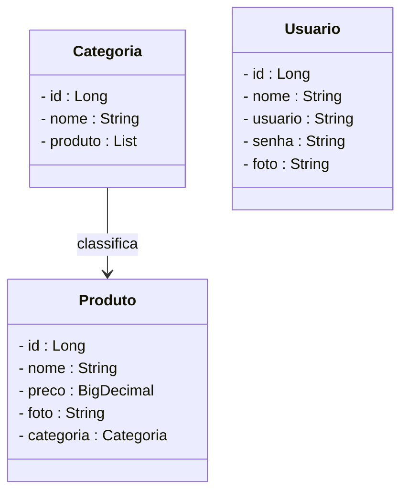
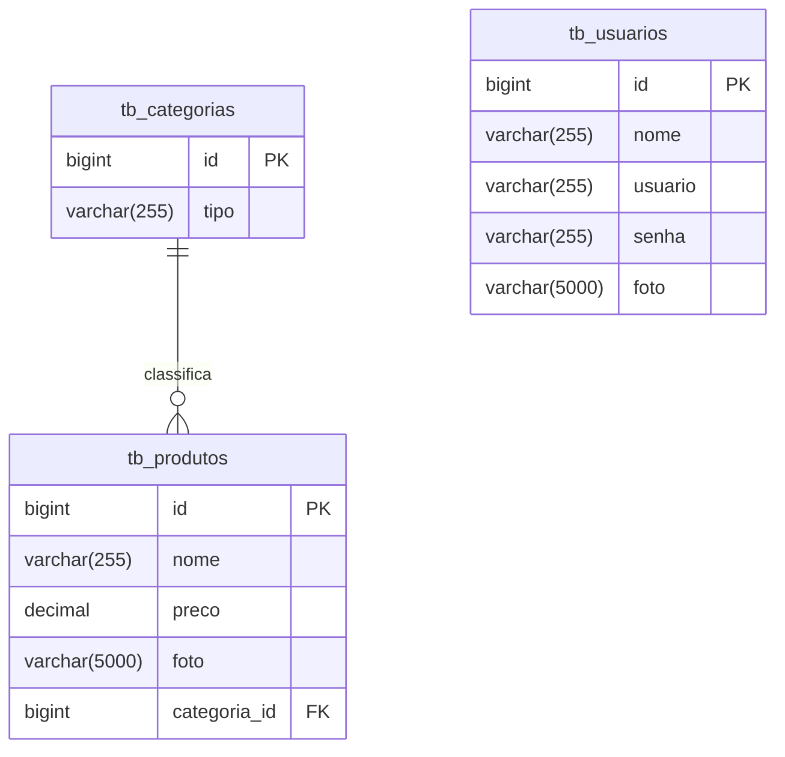

# Projeto Loja de Games - Backend com Spring Boot

<br />

<div align="center">
     
</div>

<br />

<div align="center">
  
  
  
  
  
  
  

</div>

<br />

## 1. Descrição

A **Loja de Games** é uma aplicação que permite navegar, cadastrar, atualizar e apagar os jogos cadastrados na loja, além de gerenciar as categorias e os usuários. Este projeto foi desenvolvido com fins educacionais, simulando um sistema real de e-commerce de games, para praticar conceitos de API REST com Java e Spring Boot.

Entre os principais recursos de uma loja de games, destacam-se:

1. Cadastro, consulta, edição e remoção de jogos
2. Classificação dos jogos por categorias específicas
3. Cadastro e autenticação de usuários
4. Listagem de jogos por categoria
5. Controle de acesso e segurança nas operações sensíveis

<br />

## 2. Sobre esta API

A API da Loja de Games foi desenvolvida utilizando **Java** e o **framework Spring**, seguindo os princípios da Arquitetura MVC e REST. Ela oferece endpoints para o gerenciamento dos recursos **Usuário**, **Produtos** e **Categoria**, permitindo a interação entre os usuários e o catálogo de jogos disponíveis.

<br />

### 2.1. Principais funcionalidades da API:

1. Consulta, cadastro, login e atualização dos dados dos usuários
2. Consulta, criação e gerenciamento de categorias para organizar os jogos
3. Cadastro, edição, listagem e exclusão de jogos
4. Associação de jogos a categorias
5. Autenticação via token JWT para segurança nas requisições

<br />

## 3. Diagrama de Classes

O **Diagrama de Classes** representa a estrutura do sistema, mostrando classes, atributos, métodos e os relacionamentos entre as entidades principais: Jogo, Categoria e Usuário.



<br />

## 4. Diagrama Entidade-Relacionamento (DER)

O **DER** representa como os dados estão organizados no banco de dados relacional, incluindo tabelas e relacionamentos.



<br />

## 5. Tecnologias utilizadas

| Item                          | Descrição       |
| ----------------------------- | --------------- |
| **Servidor**                  | Tomcat          |
| **Linguagem de programação**  | Java            |
| **Framework**                 | Spring Boot     |
| **ORM**                       | JPA + Hibernate |
| **Banco de dados Relacional** | MySQL           |
| **Segurança**                 | Spring Security |
| **Autenticação**              | JWT             |
| **Testes automatizados**      | JUnit           |
| **Documentação**              | SpringDoc       |

<br />

## 6. Requisitos

Para executar os códigos localmente, você precisará:

- [Java JDK 17+](https://www.oracle.com/java/technologies/javase/jdk17-archive-downloads.html)
- Banco de dados [MySQL](https://dev.mysql.com/downloads/)
- [STS](https://spring.io/tools)
- [Insomnia](https://insomnia.rest/download) ou [Postman](https://www.postman.com/)

<br />

## 7. Como Executar o projeto no STS

<br />

### 7.1. Importando o Projeto

1. Clone o repositório do Projeto [Loja de Games](https://github.com/squarcinihelena/loja_games_api.git) dentro da pasta do *Workspace* do STS

```bash
git clone (https://github.com/squarcinihelena/loja_games_api.git)
```

1. **Abra o STS** e selecione a pasta do *Workspace* onde você clonou o repositório do projeto
2. No menu superior do STS, clique em **File 🡲 Import...**
3. Na janela **Import**, selecione **General 🡲 Existing Projects into Workspace** e clique em **Next**
4. No item **Select root directory**, clique em **Browse...** e selecione a pasta do Workspace onde clonou o repositório
5. O STS reconhecerá o projeto automaticamente
6. Marque o Projeto Loja de Games no item **Projects** e clique em **Finish**

<br />

### 7.2. Executando o projeto

1. Na Guia **Boot Dashboard**, localize o **Projeto Loja de Games**
2. Selecione o **Projeto Loja de Games**
3. Clique no botão **Start or Restart**  para iniciar a aplicação
4. Caso solicitado, autorize o acesso à rede para o projeto
5. Acompanhe a inicialização no console do STS
6. Verifique se o banco de dados `db_lojadegames` foi criado corretamente com as tabelas necessárias
7. Utilize o [Insomnia](https://insomnia.rest/) ou o [Postman](https://www.postman.com/) para testar os endpoints

<br />

> [!TIP]
>
> Ao acessar a URL `http://localhost:8080` em seu navegador, a interface do Swagger será carregada automaticamente, permitindo a visualização e interação com os endpoints da API e consulta dos modelos de dados.

<br />

## 8. Implementações Futuras

- [x] Consulta de produtos pelo maior e menor preço
- [ ] Segurança da aplicação
- [ ] Testes
- [ ] Deploy

<br />

## 9. Contribuição

- Criar uma **issue**
- Enviar um **pull request**
- Compartilhar com colegas que estejam aprendendo Java!

<br />

## 10. Contato

Desenvolvido por [**Helena**](https://github.com/squarcinihelena)
Para dúvidas, sugestões ou colaborações, entre em contato via GitHub ou abra uma issue!
